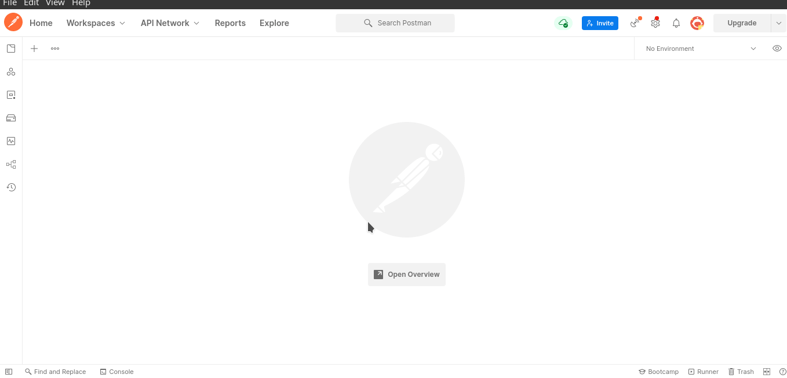
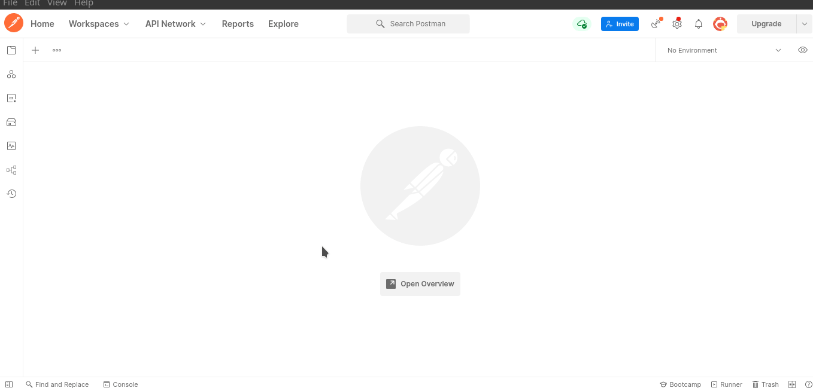
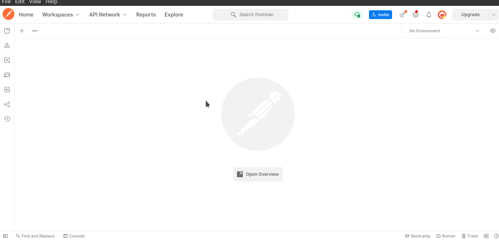

Для авторизации через POSTMAN и тестирования API следуйте следующим шагам:

1. Откройте приложение POSTMAN и создайте новый запрос.
    В Postman запросы — основная рабочая единица. Чтобы выполнить запрос,
    нажмите «+» и выберите его тип. Например: «основной — GET». 
    После укажите URL в адресной строке и щелкните Send.





2. Если ваш API требует авторизации, выберите вкладку "Authorization" и выберите тип авторизации, 
который вы хотите использовать (например, Basic Auth, OAuth 2.0 или Bearer Token).



3. Введите необходимые данные для авторизации, такие как имя пользователя и пароль,
токен или ключ доступа.

4. Нажмите кнопку "Send" для отправки запроса.

5. Просмотрите ответ от вашего API, чтобы убедиться, что он возвращает ожидаемые данные.

Для тестирования своих API в POSTMAN вы можете использовать функциональность тестовых скриптов.
Тестовые скрипты позволяют автоматически проверять ответы на запросы API и проверять,
соответствуют ли они ожидаемым результатам.

Чтобы создать тестовый скрипт, выберите вкладку "Tests" в окне запроса.
Затем введите код тестового скрипта, который будет проверять ответ от вашего API.
Например, если вы ожидаете, что ваш API вернет статус 200,
вы можете написать следующий тестовый скрипт:

```
pm.test("Status code is 200", function () {
    pm.response.to.have.status(200);
});
```

После написания тестового скрипта нажмите кнопку "Send" для выполнения запроса и проверки результата.
Если тестовый скрипт возвращает ошибку, вы увидите сообщение об ошибке в окне "Test Results".

Так же для вашего удобства предоставляю ссылку на хорошее видео по тестированию API
https://www.youtube.com/watch?v=VywxIQ2ZXw4&ab_channel=freeCodeCamp.org

